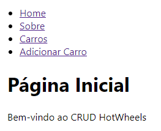

## Nome: `Hamilton Marques da Rosa Junior`

Para executar este projeto:

1. Entre pasta hamilton-projeto-fase-1 no terminal:
```
cd hamilton-projeto-fase-1
```

2. Rode npm install para instalar as dependências do projeto:


```
npm install
```

3. E em seguida, npm start, para iniciar a execução do projeto.

```
npm start
```

Após execução do projeto, este é o resultado esperado no navegador:


## Introdução

Este projeto contém uma estrutura básica a partir do template CRA, com o objetivo de desenvolver um CRUD (Create, Read, Update, Delete) inicial para uma coleção carrinhos HotWheels.

## Componentes

Os componentes estão no diretório `./src/components` e eles possuem as seguintes características:
- CarList:
  - Descrição: este componente exibe a lista de carrinhos. Possibilita a exclusão e o direcionamento para edição de um carrinho.

- CarForm:
  - Descrição: este componente adiciona um novo carrinho.

- CarDetail:
  - Descrição: este componente edita os dados de um carrinho.

- AppContext:
  - Descrição: este componente permite o compartilhamento de dados entre componentes.

- AppProvider:
  - Descrição: este componente carrega os dados iniciais da lista de carrinhos, contendo uma função para fornecer dados.

- Navbar:
  - Descrição: este componente utiliza Link do React Router para mostrar as páginas disponíveis em uma barra de navegação

## Conclusão

Este projeto é apenas para fins educacionais, sendo parte da Fase 1 do projeto da disciplina de Desenvolvimento de Sistemas Frontend PUCRS.